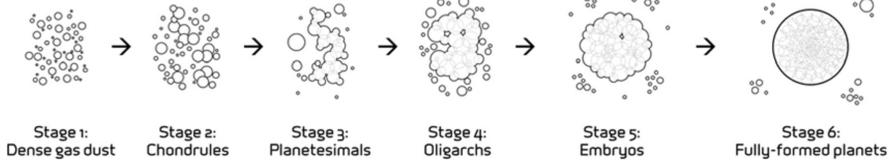

Hello ISCI 3A12! The following preparatory material is for your upcoming seminar on **Wednesday, February 28th 2024 at 4:30 pm (HH 305)**. In this seminar, we will be covering the specific steps to the classical theory of planetary formation, and how this hypothesis has changed in recent years due to Atacama Large Millimeter/submillimeter Array (ALMA) and Kepler technologies. In order to prepare for the lesson. We have developed some short review materials, videos, and an assessment quiz to test your knowledge before the seminar. 

## Pre-Seminar Preparatory Materials
Use the following list to ensure you have all the necessary content for the seminar:
1. Watch the **introductory video** (ISCI 3A12>Channels>LUE)
      - Complete all activities within the video **(DUE: 2:00 pm on Wednesday, February 28th 2024)**
2. Read through the **content review and introduction** below
   - Includes links, videos, and summaries
3. Complete the pre-assessment quiz **(DUE: 2:00 pm on Wednesday, February 28th 2024)**
4. Download the **in-class seminar** worksheet (Note that handouts will be provided for those who do not have a tablet/fillable PDF extension)

Please take the time to thoroughly prepare and make sure you have all the required materials to get ready for an engaging lesson! 

> Sami, Maya, Naya, Max, Keira, Ben 

## Introductory Video Review:

From the introductory video that was posted, you should have been able to understand the following topics:
- Understand all **relevant content from RP1**: The definition of an exoplanet, its naming conventions, Kepler’s laws, and what affects an exoplanet’s surface temperature
- An overview of the main detection methods and how they work in combination to **detect key characteristics of exoplanets**
- How exoplanets are **placed into categories**, including Terrestrial, Super-Earths, Neptune-Like, Mini-Neptunes, and Gas Giants. Notably, these categories are considered to be more of a spectrum
- A basic understanding of **planetary formation** through the nebular hypothesis, and key terms such as planetesimals and protoplanetary disk. 

As mentioned, this seminar will be focusing on the theories regarding planetary formation. Therefore, please make sure you are familiar with the topics pertaining to this discussed in the video. A recap of the steps discussed in the video were:

1. Stars form from the **gravitational collapse**  of a solar nebula.
    - As the radius of this cloud disappears, the rate of spin increases along with the formation of a disk of material, referred to as an accretion disk.
2. Through collisions of particles within the disk itself, **planetesimals are formed**.
3. Some planetesimals continue to accumulate to form larger planets, depending on **interactions with other planetesimals** within the disk.
4. Smaller accretion disks **form around these planetesimals** , leading to the creation of moons.
5. **More work remains** to further understand the formation of planets both within our solar system as well as outside our solar system.

Figure 1 highlights the simplified steps as to how dense gas dust develops into planets over time.

*Figure 1: The standard phases involved in planetary formation, showing the evolution of dense gas dust into planets through gradual accretion (Sosa, 2019).*

The theory of planetary formation, much like the categorisation of exoplanets, is difficult to understand with current research. The diversity of planetary systems that exist beyond our own have further exemplified that there may be varying demographics and complexities. With recent advancements and direct observation of protostars, we have been able to further understand the structure and time scales that are involved in exoplanet formation. You have probably seen the iconic ALMA images pertaining to this (linked below), however, this is just the beginning. The following videos and links below are to further your knowledge and get an understanding before the seminar. Note that some readings are optional.

## External Content
#### MANDATORY
- [“We Might Be Wrong About Planet Formation” by SciShow Space (2022)](https://www.youtube.com/watch?v=Umu613bK7W8&ab_channel=SciShowSpace): Gives insight into how leading discoveries are altering our classical views on planet formation and highlighting gaps in the theories. 
- [“The Epoch of Planet Formation, Times Twenty” by the Harvard and Smithsonian Centre for Astrophysics](https://cfa.harvard.edu/news/epoch-planet-formation-times-twenty): Provides insight into the capabilities of ALMA in planet formation research: 
- [“Planet formation by pebble accretion in ringed disks” by Morbidelli (2020)](https://doi.org/10.1051/0004-6361/202037983 )
#### OPTIONAL
- [Chapter 3 on planet formation theory by Drazkowska et al. (2023)](https://doi.org/10.48550/arXiv.2203.09759), published in the Protostars and Planets VII book - provides insight into emerging theories and current data. 
- [Discover Connect’s summary episode](https://youtu.be/dszw4ewPDfA?si=lethHMcML8zzRLtB) on planetary formation:
- [“Formation of the Planets” By Lincoln Learning Solutions](https://www.youtube.com/watch?v=sCkhEu3lYNc&ab_channel=LincolnLearningSolutions): Provides a simplified summary of planetary formation, narrowed to our solar system. 
- [Article on ALMA by the U.S National Radio Astronomy Observatory (2023) titled](https://public.nrao.edu/news/alma-observation-of-young-star-reveals-details-of-dust-grains/
) “ALMA Observation of Young Star Reveals Details of Dust Grains.”

## Pre-Assessment Quiz
[Here is the link](https://forms.office.com/r/6Fk2kpZQrD ) for the quiz to be completed by Wednesday February 28th at 2:00 pm!

> Take a moment to reflect on what you already know and some existing questions you have for the upcoming seminar. We look forward to seeing you there ISCI 3A12!

## References

Drazkowska, J., Bitsch, B., Lambrechts, M., Mulders, G.D., Harsono, D., Vazan, A., Liu, B., Ormel, C.W., Kretke, K. and Morbidelli, A., 2022. Planet Formation Theory in the Era of ALMA and Kepler: from Pebbles to Exoplanets. [online] https://doi.org/10.48550/ARXIV.2203.09759. 

Morbidelli, A., 2020. Planet formation by pebble accretion in ringed disks. Astronomy & Astrophysics, 638, p.A1. https://doi.org/10.1051/0004-6361/202037983.  

National Radio Astronomy Observatory, 2023. ALMA Observation of Young Star Reveals Details of Dust Grains. Available at: <https://public.nrao.edu/news/alma-observation-of-young-star-reveals-details-of-dust-grains/> [Accessed 23 February 2024].  

Okrusch, M. and Frimmel, H.E., 2020. The Genesis of Our Solar System. In: Mineralogy. [online] Berlin, Heidelberg: Springer Berlin Heidelberg. pp.667–676. https://doi.org/10.1007/978-3-662-57316-7_34.  

Sosa, R., 2019. Accretion theory of ideation: evaluation regimes for ideation stages. Design Science, [online] 5, p.e23. https://doi.org/10.1017/dsj.2019.22. 

We Might Be Wrong About Planet Formation. 2022. Available at: <https://www.youtube.com/watch?v=Umu613bK7W8> [Accessed 23 February 2024]. 

